# Инструкция для работы с Git и удалёнными репозиториями

## Что такое Git?
Git - это одна из реализаций распределённых систем контроля версий, имеющая как и локальные, так и удалённые репозитории. Является самой популярной реализацией систем контроля версий в мире.

## Настройка
При первом использовании Git необходимо представиться. Для этого нужно ввести в терминале 2 команды:

Также проверим последнюю установленную версию
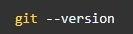
## Подготовка репозитория
Для создание репозитория необходимо выполнить команду *git init*  в папке с репозиторием и у Вас создастся репозиторий (появится скрытая папка .git) 

Для того, чтобы посмотреть какие файлы находятся в папке, нужно набрать команду *ls*. 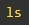
___
## Создание коммитов
Если объяснять простым языком, то ***коммит*** - это огромная копия вашего проекта в момент времени, когда этот коммит был сделан. Также Git хранит всю историю о том, когда какой коммит был сделан и кем.
___
### Git add
Для добавления измений в коммит используется команда *git add*. Чтобы использовать команду *git add* напишите *git add <имя файла>*

### Просмотр состояния репозитория
Для того, чтобы посмотреть состояние репозитория используется команда *git status*. Для этого необходимо в папке с репозиторием написать *git status*, и Вы увидите были ли измения в файлах, или их не было.

При этом, если всё хорошо, то файл будет гореть "зелёным", если нет, то "красным". Тогда надо будет проделать ещё раз команду <*git add*> затем <*git status*>.

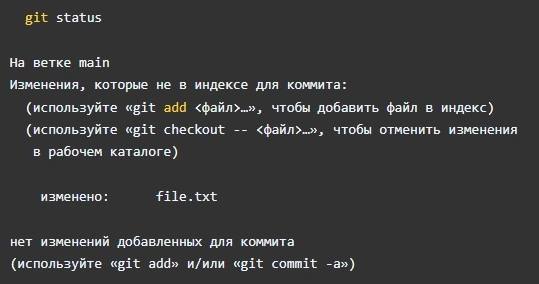

### Создание коммитов
Для того, чтобы создать коммит(сохранение) необходимо выполнить команду *git commit*. Выполняется она так: *git commit -m "<сообщение к коммиту>*. Все файлы для коммита должны быть ***ДОБАВЛЕНЫ*** и сообщение к коммиту писать ***ОБЯЗАТЕЛЬНО***.

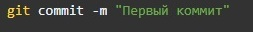

## Перемещение между сохранениями
Для того, чтобы перемещаться между коммитами, используется команда *git checkout*. Представим, что нам надо посмотреть, как выглядел наш репозиторий после второго коммита. Для этого используем команду *git checkout* и хэш второго коммита *git checkout <номер коммита>*. Кстати, можно не указывать его целиком, достаточно первых 6 символов. 

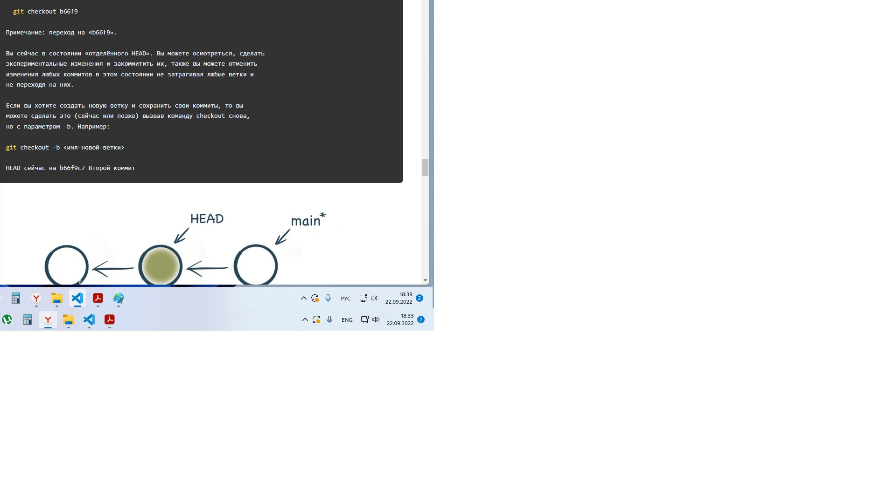

Чтобы вернуться к актуальному состояниюи продолжить работу наберите команду *git checkout master*.

## Журнал изменений
Не все коммиты будете делать вы, какие-то будут делать ваши коллеги по команде, поэтому вам может понадобиться изучить историю коммитов. Для того, чтобы посмтреть все сделанные изменения в репозитории, используется команда *git log*. Для этого достаточно выполнить команду *git log* в папке с репозиторием. Листать историю коммитов можно стрелочками, а чтобы выйти нужно нажать на клавиатуре кнопку <**q**>.

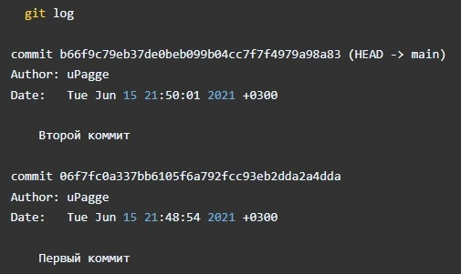
___
## Ветки в Git
Почти каждая система контроля версий в какой-то форме поддерживает ветвление. Используя ветвление, вы отклоняетесь от основной линии разработки и продолжаете работу независимо от неё, не вмешиваясь в основную линию. Ветки в Git, как и коммиты, невероятно легковесны. Ветка в Git — это простой перемещаемый указатель. Так как создание множества веток никак не отражается на памяти или жестком диске, удобно создавать отдельные ветки под каждую задачу.

### Создание ветки

Для того, чтобы создать ветку, используется команда *git branch*. Делается это следующим образом в папке с репозиторием: *git branch <название новой ветки>*

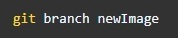

Команда *git branch* позволяет не только создавать ветки, но и просматривать существующие. Ветка, на которой вы находитесь помечается звездочкой.

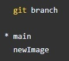

Если мы попробуем сделать изменения, то они произойдут в ветке main, а не в новой ветке newImage.
Сообщим Git, что хотим переключиться на другую ветку:

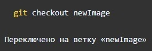

Рекомендуется на каждую задачу создавать отдельную ветку, а потом вливать ее в общую ветку разработки.
Чтобы создать новую ветку и переключиться на неё с помощью одной команды:

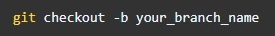

## Слияние веток
Как объединять изменения из двух разных веток, после того как вы выполнили свою задачу в отдельной ветке? Для того чтобы дабавить ветку в текущую ветку используется команда *git merge <name branch>*.

Слияния создают особый вид коммита, который имеет сразу двух родителей. Коммит с двумя родителями обычно означает, что мы хотим объединить изменения из одного коммита с другим коммитом и всеми их родительскими коммитами.

Втащим все изменения из ветки newImage в ветку main:

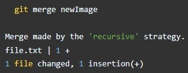

## Удаление веток
Для удаления ветки ввести команду "git branch -d 'name branch'"

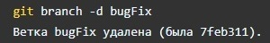