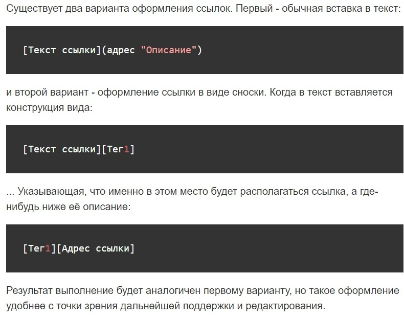
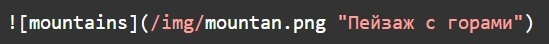
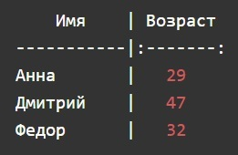
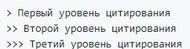

# Инструкция для работы с Git и удалёнными репозиториями

## Что такое Git?
Git - это одна из реализаций распределённых систем контроля версий, имеющая как и локальные, так и удалённые репозитории. Является самой популярной реализацией систем контроля версий в мире.

## Настройка
При первом использовании Git необходимо представиться. Для этого нужно ввести в терминале 2 команды:

Также проверим последнюю установленную версию

## Подготовка репозитория
Для создание репозитория необходимо выполнить команду *git init*  в папке с репозиторием и у Вас создастся репозиторий (появится скрытая папка .git) 

Для того, чтобы посмотреть какие файлы находятся в папке, нужно набрать команду *ls*. 
___
## Создание коммитов
Если объяснять простым языком, то ***коммит*** - это огромная копия вашего проекта в момент времени, когда этот коммит был сделан. Также Git хранит всю историю о том, когда какой коммит был сделан и кем.
___
### Git add
Для добавления измений в коммит используется команда *git add*. Чтобы использовать команду *git add* напишите *git add <имя файла>*

### Просмотр состояния репозитория
Для того, чтобы посмотреть состояние репозитория используется команда *git status*. Для этого необходимо в папке с репозиторием написать *git status*, и Вы увидите были ли измения в файлах, или их не было.

При этом, если всё хорошо, то файл будет гореть "зелёным", если нет, то "красным". Тогда надо будет проделать ещё раз команду <*git add*> затем <*git status*>.

### Создание коммитов
Для того, чтобы создать коммит(сохранение) необходимо выполнить команду *git commit*. Выполняется она так: *git commit -m "<сообщение к коммиту>*. Все файлы для коммита должны быть ***ДОБАВЛЕНЫ*** и сообщение к коммиту писать ***ОБЯЗАТЕЛЬНО***.

## Перемещение между сохранениями
Для того, чтобы перемещаться между коммитами, используется команда *git checkout*. Представим, что нам надо посмотреть, как выглядел наш репозиторий после второго коммита. Для этого используем команду *git checkout* и хэш второго коммита *git checkout <номер коммита>*. Кстати, можно не указывать его целиком, достаточно первых 6 символов. 

Чтобы вернуться к актуальному состояниюи продолжить работу наберите команду *git checkout master*.

## Журнал изменений
Не все коммиты будете делать вы, какие-то будут делать ваши коллеги по команде, поэтому вам может понадобиться изучить историю коммитов. Для того, чтобы посмтреть все сделанные изменения в репозитории, используется команда *git log*. Для этого достаточно выполнить команду *git log* в папке с репозиторием. Листать историю коммитов можно стрелочками, а чтобы выйти нужно нажать на клавиатуре кнопку <**q**>.

___
## Ветки в Git
Почти каждая система контроля версий в какой-то форме поддерживает ветвление. Используя ветвление, вы отклоняетесь от основной линии разработки и продолжаете работу независимо от неё, не вмешиваясь в основную линию. Ветки в Git, как и коммиты, невероятно легковесны. Ветка в Git — это простой перемещаемый указатель. Так как создание множества веток никак не отражается на памяти или жестком диске, удобно создавать отдельные ветки под каждую задачу.

### Создание ветки

Для того, чтобы создать ветку, используется команда *git branch*. Делается это следующим образом в папке с репозиторием: *git branch <название новой ветки>*

Команда *git branch* позволяет не только создавать ветки, но и просматривать существующие. Ветка, на которой вы находитесь помечается звездочкой.

Если мы попробуем сделать изменения, то они произойдут в ветке main, а не в новой ветке newImage.
Сообщим Git, что хотим переключиться на другую ветку:

Рекомендуется на каждую задачу создавать отдельную ветку, а потом вливать ее в общую ветку разработки.
Чтобы создать новую ветку и переключиться на неё с помощью одной команды:

## Слияние веток
Как объединять изменения из двух разных веток, после того как вы выполнили свою задачу в отдельной ветке? Для того чтобы дабавить ветку в текущую ветку используется команда *git merge <name branch>*.

Слияния создают особый вид коммита, который имеет сразу двух родителей. Коммит с двумя родителями обычно означает, что мы хотим объединить изменения из одного коммита с другим коммитом и всеми их родительскими коммитами.

Втащим все изменения из ветки newImage в ветку main:

## Удаление веток
Для удаления ветки ввести команду "git branch -d 'name branch'"

___
## Просмотр изменений в файле
Для вывода изменений в файлах по сравнению с последним коммитом, используется команда *git diff* без параметров. Команда выводит изменения в файлах, которые еще не были добавлены в индекс. Сравнение происходит с последним коммитом
Чтобы показать изменения в файлах, включая файлы, добавленные в индекс, используется команда **git diff --cached**

# Шпаргалка по синтаксису Markdown

**Markdown (маркдаун)** — облегчённый язык разметки созданный с целью написания максимально читабельного и удобного для правки текста, но пригодного для преобразования в языки для продвинутых публикаций (HTML, Rich Text и др.).
 Сегодня его широко используют в написании статей, документации (в том числе на GitHub), справочных текстов и др.

[https://learn.microsoft.com/ru-ru/contribute/markdown-reference] (справочник по Markdown)

[https://ru.wikipedia.org/wiki/Markdown] (Markdown в Википедиа)

## Заголовки
Для того чтобы написать HTML заголовок в Markdown, необходимо использовать знак # (хэш). Если необходимо несколько уровней заголовков, h1 - h6, нужно изменить количество хэшей (#) перед текстом заголовка.

# Заголовок 1
## Заголовок 2
### Заголовок 3
##### Заголовок 4
##### Заголовок 5
###### Заголовок 6

## Списки
Markdown поддерживает оба вида списков. Для организации маркерованного списка используются знаки *, + и -. От них зависит вид маркеров. Чтоб сделать многоуровневый список, нужно будет сделать отступы (4 или 8 пробелов).

С нумерованными списками все еще проще:

## Горизонтальные разделители
В HTML мы используем тег 
, в Markdown для этого служат три или более дефиса, звездочки или знака равно (-, *, =).

## Курсивное и жирное выделение
Вобще, оформление текста с Markodown становится очень простым и быстрым. Для курсива необходимо поставить знаки * вокруг текста. Для жирного начертания обрамим текст двумя звездочками, а для жирного курсива - тремя. Алтернативный синтаксис - использование знака _ по тем же правилам.

*курсив*

_курсив_

**жирный**

__жирный__

***жирный курсив***

___жирный курсив___

Чтобы совмещать и курсив и жирное начертание можно писать так:
_вот такой наглядный **пример**_

## Ссылки

Существует два варианта оформления ссылок. Первый - обычная вставка в текст:

[Использование ссылок в документации] (https://learn.microsoft.com/ru-ru/contribute/how-to-write-links)

## Изображения
Изображения помещаются на страницу также, как и ссылки, с одним отличием: в начале записи используется знак 

## Таблицы
Создание таблиц с Markdown намного нагляднее, чем в HTML. Форматирование интуитивно понятно, добавлю только что для выравнивания текста внутри ячеек используются знаки : в строке, отделяющей заголовок от основной таблицы.

## Цитаты
Для обозначения цитат в языке Markdown используется знак «больше» («>»). Его можно вставлять как перед каждой строкой цитаты, так и только перед первой строкой параграфа. Также можно создавать вложенные цитаты (цитаты внутри цитат). Для их разметки используются дополнительные уровни знаков цитирования («>»).

> Первый уровень цитирования
>> Второй уровень цитирования
>>> Третий уровень цитирования
___

### Работа с удалёнными репозиториями

Чтобы иметь возможность совместной работы над каким-либо Git-проектом, необходимо знать как управлять удалёнными репозиториями. **Удалённые репозитории** — это модификации проекта, которые хранятся в интернете или ещё где-то в сети. Их может быть несколько, каждый из которых как правило доступен для вас либо только на чтение, либо на чтение и запись. 
Совместная работа включает в себя управление удалёнными репозиториями и помещение (**push**) и получение (**pull**) данных в и из них тогда, когда нужно обменяться результатами работы. Управление удалёнными репозиториями включает умение добавлять удалённые репозитории, удалять те из них, которые больше не действуют, умение управлять различными удалёнными ветками и определять их как ослеживаемые (tracked) или нет и прочее. 

## Создание репозитория на Github

До текущего момента мы работали с локальным репозиторием, который сохранялся в папке на компьютере. Если мы хотим иметь возможность сохранения проекта в интернете, создадим репозиторий на Github. Для начала нужно зарегистрироваться на сайте **GitHub**.com под именем myuser (в вашем случае это может быть любое другое имя).

После регистрации нажимаем кнопочку "+" и вводим название репозитория. Выбираем тип **Public** (репозиторий всегда Public для бесплатной версии) и нажимаем Create.

В результате мы создали репозиторий на сайте Github. На экране мы увидим инструкцию, как соединить наш локальный репозиторий со вновь созданным. 

Добавляем удаленный репозиторий (по протоколу SSH) под именем origin (вместо origin можно использовать любое другое имя).

**git remote add origin git@github.com:myuser/project.git**

Можем просмотреть результат добавления с помощью команды:

**git remote -v**

Если все было правильно сделано, то увидим:

**origin git@github.com:myuser/project.git (fetch)**
**origin git@github.com:myuser/project.git (push)**

Для того, чтобы отменить регистрацию удаленного репозитария введите:

**git remote rm origin**

Это может понадобиться, если вы захотите поменять SSH доступ на HTTPS. После этого можно добавить его опять, например под именем github и протоколом HTTPS.

**git remote add github https://github.com/myuser/project.git**

Следующей командой вы занесете все изменения, которые были сделаны в локальном репозитории на Github.

**git push -u github master**

Ключ -u используется для того, чтобы установить связь между удаленным репозиторием github и вашей веткой master. Все дальнейшие изменения вы можете переносить на удаленный репозиторий упрощенной командой.

**git push**

## Перенос репозитория на другой компьютер

После того, как репозиторий был создан на Github, его можно скопировать на любой другой компьютер. Для этого применяется команда:

**git clone https://github.com/myuser/project.git**

Результатом выполнения этой команды будет создание папки project в текущем каталоге. Эта папка также будет содержать локальный репозиторий (то есть папку .git).

Так же можно добавить название папки, в которой вы хотите разместить локальный репозиторий.

**git clone https://github.com/myuser/project.git <myfolder>**

## Работа с одним репозиторием с разных компьютеров

С одним репозиторием с разных компьютеров может работать несколько разработчиков или вы сами, если например работаете над одним и тем же проектом дома и на работе.

Для получения обновлений с удаленного репозитория воспользуйтесь командой:

**git pull**

Если вы изменили ваши локальные файлы, то команда git pull выдаст ошибку. Если вы уверены, что хотите перезаписать локальные файлы, файлами из удаленного репозитория то выполните команды:

**git fetch --all**
**git reset --hard github/master**

Вместо github подставьте название вашего удаленного репозитория, которое вы зарегистрировали командой **git push -u**.

Как мы уже знаем, для того чтобы изменения выложить на удаленный репозиторий используется команда:

**git push**

В случае, если в удаленном репозитории лежат файлы с версией более новой, чем у вас в локальном, то команда git push выдаст ошибку. Если вы уверены, что хотите перезаписать файлы в удаленном репозитории несмотря на конфликт версий, то воспользуйтесь командой:

**git push -f**

Иногда возникает необходимость отложить ваши текущие изменения и поработать над файлами, которые находятся в удаленном репозитории. Для этого отложите текущие изменения командой:

**git stash**

После выполнения этой команды ваша локальная директория будет содержать файлы такие же, как и при последнем коммите. Вы можете загрузить новые файлы из удаленного репозитория командой *git pull* и после этого вернуть ваши изменения которые вы отложили командой:

**git stash pop**
