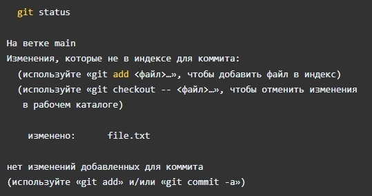
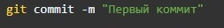
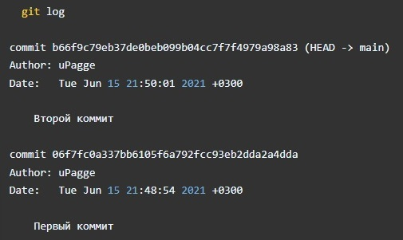
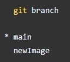
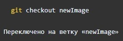
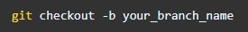
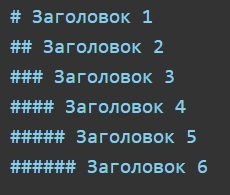

# Инструкция для работы с Git и удалёнными репозиториями

## Что такое Git?
Git - это одна из реализаций распределённых систем контроля версий, имеющая как и локальные, так и удалённые репозитории. Является самой популярной реализацией систем контроля версий в мире.

## Настройка
При первом использовании Git необходимо представиться. Для этого нужно ввести в терминале 2 команды:

Также проверим последнюю установленную версию

## Подготовка репозитория
Для создание репозитория необходимо выполнить команду *git init*  в папке с репозиторием и у Вас создастся репозиторий (появится скрытая папка .git) 

Для того, чтобы посмотреть какие файлы находятся в папке, нужно набрать команду *ls*. 
___
## Создание коммитов
Если объяснять простым языком, то ***коммит*** - это огромная копия вашего проекта в момент времени, когда этот коммит был сделан. Также Git хранит всю историю о том, когда какой коммит был сделан и кем.
___
### Git add
Для добавления измений в коммит используется команда *git add*. Чтобы использовать команду *git add* напишите *git add <имя файла>*

### Просмотр состояния репозитория
Для того, чтобы посмотреть состояние репозитория используется команда *git status*. Для этого необходимо в папке с репозиторием написать *git status*, и Вы увидите были ли измения в файлах, или их не было.

При этом, если всё хорошо, то файл будет гореть "зелёным", если нет, то "красным". Тогда надо будет проделать ещё раз команду <*git add*> затем <*git status*>.

### Создание коммитов
Для того, чтобы создать коммит(сохранение) необходимо выполнить команду *git commit*. Выполняется она так: *git commit -m "<сообщение к коммиту>*. Все файлы для коммита должны быть ***ДОБАВЛЕНЫ*** и сообщение к коммиту писать ***ОБЯЗАТЕЛЬНО***.

## Перемещение между сохранениями
Для того, чтобы перемещаться между коммитами, используется команда *git checkout*. Представим, что нам надо посмотреть, как выглядел наш репозиторий после второго коммита. Для этого используем команду *git checkout* и хэш второго коммита *git checkout <номер коммита>*. Кстати, можно не указывать его целиком, достаточно первых 6 символов. 

Чтобы вернуться к актуальному состояниюи продолжить работу наберите команду *git checkout master*.

## Журнал изменений
Не все коммиты будете делать вы, какие-то будут делать ваши коллеги по команде, поэтому вам может понадобиться изучить историю коммитов. Для того, чтобы посмтреть все сделанные изменения в репозитории, используется команда *git log*. Для этого достаточно выполнить команду *git log* в папке с репозиторием. Листать историю коммитов можно стрелочками, а чтобы выйти нужно нажать на клавиатуре кнопку <**q**>.

___
## Ветки в Git
Почти каждая система контроля версий в какой-то форме поддерживает ветвление. Используя ветвление, вы отклоняетесь от основной линии разработки и продолжаете работу независимо от неё, не вмешиваясь в основную линию. Ветки в Git, как и коммиты, невероятно легковесны. Ветка в Git — это простой перемещаемый указатель. Так как создание множества веток никак не отражается на памяти или жестком диске, удобно создавать отдельные ветки под каждую задачу.

### Создание ветки

Для того, чтобы создать ветку, используется команда *git branch*. Делается это следующим образом в папке с репозиторием: *git branch <название новой ветки>*

Команда *git branch* позволяет не только создавать ветки, но и просматривать существующие. Ветка, на которой вы находитесь помечается звездочкой.

Если мы попробуем сделать изменения, то они произойдут в ветке main, а не в новой ветке newImage.
Сообщим Git, что хотим переключиться на другую ветку:

Рекомендуется на каждую задачу создавать отдельную ветку, а потом вливать ее в общую ветку разработки.
Чтобы создать новую ветку и переключиться на неё с помощью одной команды:

## Слияние веток
Как объединять изменения из двух разных веток, после того как вы выполнили свою задачу в отдельной ветке? Для того чтобы дабавить ветку в текущую ветку используется команда *git merge <name branch>*.

Слияния создают особый вид коммита, который имеет сразу двух родителей. Коммит с двумя родителями обычно означает, что мы хотим объединить изменения из одного коммита с другим коммитом и всеми их родительскими коммитами.

Втащим все изменения из ветки newImage в ветку main:

## Удаление веток
Для удаления ветки ввести команду "git branch -d 'name branch'"

___
## Просмотр изменений в файле
Для вывода изменений в файлах по сравнению с последним коммитом, используется команда *git diff* без параметров. Команда выводит изменения в файлах, которые еще не были добавлены в индекс. Сравнение происходит с последним коммитом
Чтобы показать изменения в файлах, включая файлы, добавленные в индекс, используется команда **git diff --cached**

# Шпаргалка по синтаксису Markdown

**Markdown (маркдаун)** — облегчённый язык разметки созданный с целью написания максимально читабельного и удобного для правки текста, но пригодного для преобразования в языки для продвинутых публикаций (HTML, Rich Text и др.).
 Сегодня его широко используют в написании статей, документации (в том числе на GitHub), справочных текстов и др.

[https://learn.microsoft.com/ru-ru/contribute/markdown-reference] (справочник по Markdown)

[https://ru.wikipedia.org/wiki/Markdown] (Markdown в Википедиа)

## Заголовки
Для того чтобы написать HTML заголовок в Markdown, необходимо использовать знак # (хэш). Если необходимо несколько уровней заголовков, h1 - h6, нужно изменить количество хэшей (#) перед текстом заголовка.

# Заголовок 1
## Заголовок 2
### Заголовок 3
##### Заголовок 4
##### Заголовок 5
###### Заголовок 6

## Списки
Markdown поддерживает оба вида списков. Для организации маркерованного списка используются знаки *, + и -. От них зависит вид маркеров. Чтоб сделать многоуровневый список, нужно будет сделать отступы (4 или 8 пробелов).

С нумерованными списками все еще проще:

## Горизонтальные разделители
В HTML мы используем тег 
, в Markdown для этого служат три или более дефиса, звездочки или знака равно (-, *, =).

## Курсивное и жирное выделение
Вобще, оформление текста с Markodown становится очень простым и быстрым. Для курсива необходимо поставить знаки * вокруг текста. Для жирного начертания обрамим текст двумя звездочками, а для жирного курсива - тремя. Алтернативный синтаксис - использование знака _ по тем же правилам.

*курсив*

_курсив_

**жирный**

__жирный__

***жирный курсив***

___жирный курсив___

Чтобы совмещать и курсив и жирное начертание можно писать так:
_вот такой наглядный **пример**_

## Ссылки

Существует два варианта оформления ссылок. Первый - обычная вставка в текст:

[Использование ссылок в документации] (https://learn.microsoft.com/ru-ru/contribute/how-to-write-links)

## Изображения
Изображения помещаются на страницу также, как и ссылки, с одним отличием: в начале записи используется знак 

## Таблицы
Создание таблиц с Markdown намного нагляднее, чем в HTML. Форматирование интуитивно понятно, добавлю только что для выравнивания текста внутри ячеек используются знаки : в строке, отделяющей заголовок от основной таблицы.

## Цитаты
Для обозначения цитат в языке Markdown используется знак «больше» («>»). Его можно вставлять как перед каждой строкой цитаты, так и только перед первой строкой параграфа. Также можно создавать вложенные цитаты (цитаты внутри цитат). Для их разметки используются дополнительные уровни знаков цитирования («>»).

> Первый уровень цитирования
>> Второй уровень цитирования
>>> Третий уровень цитирования
___

### Работа с удалёнными репозиториями

Чтобы иметь возможность совместной работы над каким-либо Git-проектом, необходимо знать как управлять удалёнными репозиториями. **Удалённые репозитории** — это модификации проекта, которые хранятся в интернете или ещё где-то в сети. Их может быть несколько, каждый из которых как правило доступен для вас либо только на чтение, либо на чтение и запись. 
Совместная работа включает в себя управление удалёнными репозиториями и помещение (**push**) и получение (**pull**) данных в и из них тогда, когда нужно обменяться результатами работы. Управление удалёнными репозиториями включает умение добавлять удалённые репозитории, удалять те из них, которые больше не действуют, умение управлять различными удалёнными ветками и определять их как ослеживаемые (tracked) или нет и прочее. 

## Просмотр удалённых репозиториев
Для того, чтобы просмотреть список настроенных удалённых репозиториев, вы можете запустить команду _**git remote**_. Она выведет названия доступных удалённых репозиториев. Если вы клонировали репозиторий, то увидите как минимум origin — имя по умолчанию, которое Git даёт серверу, с которого производилось клонирование.

Вы можете также указать ключ *git remote -v*, чтобы просмотреть адреса для чтения и записи, привязанные к репозиторию:

## Добавление удалённых репозиториев
В предыдущих разделах мы упомянули и немного продемонстрировали добавление удалённых репозиториев, сейчас мы рассмотрим это более детально. Чтобы добавить новый удалённый Git-репозиторий под именем-сокращением, к которому будет проще обращаться, выполните git remote add [сокращение] [url]: $ git remote origin $ git remote add pb git://github.com/paulboone/ticgit.git $ git remote -v origin git://github.com/schacon/ticgit.git pb git://github.com/paulboone/ticgit.git Теперь вы можете использовать в командной строке имя pb вместо полного URL. Например, если вы хотите извлечь (fetch) всю информацию, которая есть в репозитории Павла, но нет в вашем, вы можете выполнить git fetch pb: $ git fetch pb remote: Counting objects: 58, done. remote: Compressing objects: 100% (41/41), done. remote: Total 44 (delta 24), reused 1 (delta 0) Unpacking objects: 100% (44/44), done. From git://github.com/paulboone/ticgit * [new branch] master -> pb/master * [new branch] ticgit -> pb/ticgit Ветка master Павла теперь доступна локально как pb/master. Вы можете слить (merge) её в одну из ваших веток, или теперь вы можете перейти на эту ветку если вы хотите её просмотреть.
Fetch и Pull
Как вы только что узнали, для получения данных из удалённых проектов, следует выполнить: $ git fetch [remote-name] Данная команда связывается с указанным удалённым проектом и забирает все те данные проекта, которых у вас ещё нет. После того как вы выполнили команду, у вас должны появиться ссылки на все ветки из этого удалённого проекта. Теперь эти ветки в любой момент могут быть просмотрены или слиты. (В Главе Git на сервере мы перейдём к более детальному рассмотрению, что такое ветки и как их использовать.) Когда вы клонируете репозиторий, команда clone автоматически добавляет этот удалённый репозиторий под именем origin. Таким образом git fetch origin извлекает все наработки, отправленные (push) на этот сервер после того, как вы склонировали его (или получили изменения с помощью fetch). Важно отметить, что команда fetch забирает данные в ваш локальный репозиторий, но не сливает их с какими-либо вашими наработками, и не модифицирует то, над чем вы работаете в данный момент. Вам необходимо вручную слить эти данные с вашими, когда вы будете готовы. Если у вас есть ветка настроенная на отслеживание удалённой ветки (для дополнительной информации смотри следующий раздел и Главу Ветвление в Git), то вы можете использовать команду git pull. Она автоматичеси извлекает и затем сливает данные из удалённой ветки в вашу текущую ветку. Этот способ может для вас оказаться более простым или более удобным. К тому же по умолчанию команда git clone автоматически настраивает вашу локальную ветку master на отслеживание удалённой ветки master на сервере, с которого вы клонировали (подразумевается, что на удалённом сервере есть ветка master). Выполнение git pull как правило извлекает (fetch) данные с сервера, с которого вы изначально склонировали, и автоматически пытается слить (merge) их с кодом, над которым вы в данный момент работаете.
Push
Когда ваш проект достигает момента, когда вы хотите поделиться наработками, вам необходимо отправить (push) их в главный репозиторий. Команда для этого действия простая: git push [удал. сервер] [ветка]. Чтобы отправить вашу ветку master на сервер origin (повторимся, что клонирование как правило настраивает оба этих имени автоматически), вы можете выполнить следующую команду для отправки наработок обратно на сервер: $ git push origin master Эта команда срабатывает только в случае, если вы клонировали с сервера, на котором у вас есть права на запись, и если никто другой с тех пор не выполнял команду push. Если вы и кто-то ещё одновременно клонируете, затем он выполняет команду push, а затем команду push выполняете вы, то ваш push точно будет отклонён. Вам придётся сначала вытянуть (pull) их изменения и объединить с вашими. Только после этого вам будет позволено выполнить push. Смотри Главу Ветвление в Git для более подробного описания как отправлять (push) данные на удалённый сервер.
## Инспекция удалённого репозитория
Если хотите получить побольше информации об одном из удалённых репозиториев, вы можете использовать команду git remote show [удал. сервер]. Если вы выполните эту команду с некоторым именем, например, origin, вы получите что-то подобное: $ git remote show origin * remote origin URL: git://github.com/schacon/ticgit.git Remote branch merged with 'git pull' while on branch master master Tracked remote branches master ticgit Она выдаёт URL удалённого репозитория, а также информацию об отслеживаемых ветках. Эта команда любезно сообщает вам, что, если вы находясь на ветке master, выполните git pull, ветка master с удалённого сервера будет автоматически влита в вашу сразу после получения всех необходимых данных. Она также выдаёт список всех полученных ею ссылок. Это был пример для простой ситуации, и наверняка вы встретились с чем-то подобным. Однако, если вы используете Git более интенсивно, вы можете увидеть гораздо большее количество информации от git remote show: $ git remote show origin * remote origin URL: git@github.com:defunkt/github.git Remote branch merged with 'git pull' while on branch issues issues Remote branch merged with 'git pull' while on branch master master New remote branches (next fetch will store in remotes/origin) caching Stale tracking branches (use 'git remote prune') libwalker walker2 Tracked remote branches acl apiv2 dashboard2 issues master postgres Local branch pushed with 'git push' master:master Данная команда показывает какая именно локальная ветка будет отправлена на удалённый сервер по умолчанию при выполнении git push. Она также показывает каких веток с удалённого сервера у вас ещё нет, какие ветки всё ещё есть у вас, но уже удалены на сервере. И для нескольких веток показано какие удалённые ветки будут в них влиты при выполнении git pull.
## Удаление и переименование удалённых репозиториев
Для переименования ссылок в новых версиях Git можно вылолнить *git remote rename*, это изменит сокращённое имя, используемое для удалённого репозитория. Например, если вы хотите переименовать pb в paul, вы можете сделать это следующим образом: < git remote rename pb paul > git remote origin paul Стоит упомянуть, что это также меняет для вас имена удалённых веток. То, к чему вы обращались как pb/master, стало paul/master. Если по какой-то причине вы хотите удалить ссылку (вы сменили сервер или больше не используете определённое зеркало, или, возможно, контрибьютор перестал быть активным), вы можете использовать git remote rm: $ git remote rm paul $ git remote origin 

## Создание репозитория на Github

До текущего момента мы работали с локальным репозиторием, который сохранялся в папке на компьютере. Если мы хотим иметь возможность сохранения проекта в интернете, создадим репозиторий на Github. Для начала нужно зарегистрироваться на сайте github.com под именем myuser (в вашем случае это может быть любое другое имя).

После регистрации нажимаем кнопочку "+" и вводим название репозитория. Выбираем тип Public (репозиторий всегда Public для бесплатной версии) и нажимаем Create.

В результате мы создали репозиторий на сайте Github. На экране мы увидим инструкцию, как соединить наш локальный репозиторий со вновь созданным. Часть команд нам уже знакома.

Добавляем удаленный репозиторий (по протоколу SSH) под именем origin (вместо origin можно использовать любое другое имя).

git remote add origin git@github.com:myuser/project.git

Можем просмотреть результат добавления с помощью команды:

git remote -v

Если все было правильно сделано, то увидим:

origin git@github.com:myuser/project.git (fetch)
origin git@github.com:myuser/project.git (push)

Для того, чтобы отменить регистрацию удаленного репозитария введите:

git remote rm origin

Это может понадобиться, если вы захотите поменять SSH доступ на HTTPS. После этого можно добавить его опять, например под именем github и протоколом HTTPS.

git remote add github https://github.com/myuser/project.git

Следующей командой вы занесете все изменения, которые были сделаны в локальном репозитории на Github.

git push -u github master

Ключ -u используется для того, чтобы установить связь между удаленным репозиторием github и вашей веткой master. Все дальнейшие изменения вы можете переносить на удаленный репозиторий упрощенной командой.

git push

## Перенос репозитория на другой компьютер

После того, как репозиторий был создан на Github, его можно скопировать на любой другой компьютер. Для этого применяется команда:

git clone https://github.com/myuser/project.git

Результатом выполнения этой команды будет создание папки project в текущем каталоге. Эта папка также будет содержать локальный репозиторий (то есть папку .git).

Так же можно добавить название папки, в которой вы хотите разместить локальный репозиторий.

git clone https://github.com/myuser/project.git <myfolder>

## Работа с одним репозиторием с разных компьютеров

С одним репозиторием с разных компьютеров может работать несколько разработчиков или вы сами, если например работаете над одним и тем же проектом дома и на работе.

Для получения обновлений с удаленного репозитория воспользуйтесь командой:

*git pull*

Если вы изменили ваши локальные файлы, то команда git pull выдаст ошибку. Если вы уверены, что хотите перезаписать локальные файлы, файлами из удаленного репозитория то выполните команды:

*git fetch --all*
*git reset --hard github/master*

Вместо github подставьте название вашего удаленного репозитория, которое вы зарегистрировали командой git push -u.

Как мы уже знаем, для того чтобы изменения выложить на удаленный репозиторий используется команда:

*git push*

В случае, если в удаленном репозитории лежат файлы с версией более новой, чем у вас в локальном, то команда git push выдаст ошибку. Если вы уверены, что хотите перезаписать файлы в удаленном репозитории несмотря на конфликт версий, то воспользуйтесь командой:

*git push -f*

Иногда возникает необходимость отложить ваши текущие изменения и поработать над файлами, которые находятся в удаленном репозитории. Для этого отложите текущие изменения командой:

*git stash*

После выполнения этой команды ваша локальная директория будет содержать файлы такие же, как и при последнем коммите. Вы можете загрузить новые файлы из удаленного репозитория командой git pull и после этого вернуть ваши изменения которые вы отложили командой:

*git stash pop*